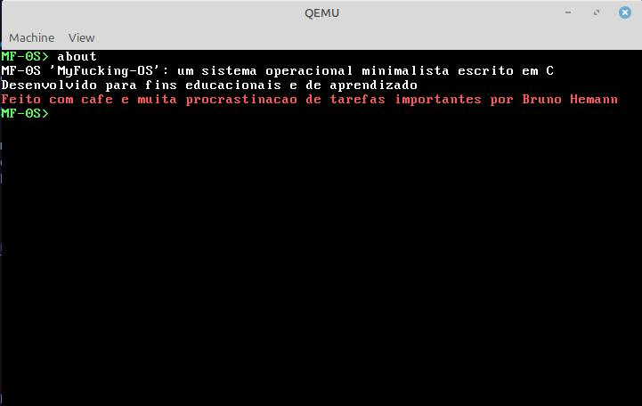
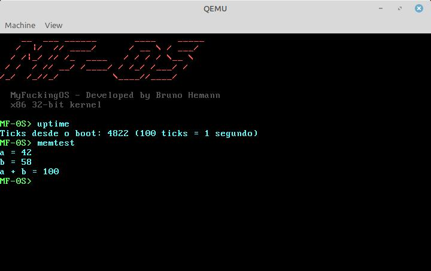

# MF-0S — MyFuckingOS

A minimal x86 kernel built from scratch in C and Assembly — a hands-on journey through boot sequences, protected mode, VGA drivers, and bare-metal hardware communication.

---

## O que é

MF-0S é um kernel x86 de 32-bit escrito do zero, sem bibliotecas, sem abstrações de sistema operacional. Cada linha de código foi escrita com o objetivo de entender o que acontece por baixo do capô de qualquer sistema operacional.

Não é um OS de produção. É um OS de aprendizado. Construído peça por peça, conceito por conceito ou seja para passar *RAIVA* e *APRENDER*.

---

## Etapa 1 — O que está implementado

- Boot via GRUB com protocolo Multiboot
- Modo protegido 32-bit
- Driver VGA text mode (80x25, 16 cores, scroll automático)
- Driver de teclado PS/2 por polling com mapa de scancodes
- Shell interativo com os comandos:
  - `help` — lista os comandos disponíveis
  - `about` — informações sobre o MF-0S
  - `clear` — limpa a tela
  - `halt` — para a CPU



---

## Etapa 2 — O que está implementado

- GDT manual — sem depender do GRUB para configuração de segmentos
- IDT — tabela de interrupções com até 256 entradas
- PIC — remapeamento de IRQs para 0x20-0x2F evitando conflito com exceções da CPU
- Teclado por interrupção via IRQ1:
  - Buffer circular para armazenamento de teclas
  - Handler dedicado substituindo o polling anterior

---

## Etapa 3 — O que está implementado

- Timer PIT a 100Hz via IRQ0 com contador de ticks
  - Comando `uptime` — exibe ticks desde o boot
- Heap com bump allocator
  - `kmalloc` com alinhamento a 4 bytes
  - Comando `memtest` — valida alocação dinâmica



---

## Etapa 4 — O que está implementado

- Paginação x86 ativa via CR0 e CR3
  - Page Directory e Page Table de 4KB alinhados
  - Identity mapping dos primeiros 4MB
  - Kernel continua acessando os mesmos endereços físicos

---
## Estrutura do projeto

```
MF-0S/
├── boot/
│   └── boot.asm          # Entry point: Multiboot header + setup da stack
├── kernel/
│   └── kernel.c          # VGA driver, teclado, shell
├── iso/
│   └── boot/
│       └── grub/
│           └── grub.cfg  # Configuração do GRUB
├── linker.ld             # Layout de memória — carrega o kernel a partir de 1MB
├── Makefile              # Build, link e geração da ISO
└── README.md
```

---

## Dependências

```bash
sudo apt install nasm qemu-system-x86 grub-pc-bin grub-common xorriso mtools build-essential
```

---

## Como compilar e rodar

```bash
# Build completo — gera mf0s.iso
make

# Rodar no QEMU
make run

# Limpar arquivos gerados
make clean
```

---

## Referências

- [OSDev Wiki](https://wiki.osdev.org) — referência principal
- [Writing a Simple OS from Scratch](https://www.cs.bham.ac.uk/~exr/lectures/opsys/10_11/lectures/os-dev.pdf) — Nick Blundell
- [Operating Systems: Three Easy Pieces](https://ostep.org) — Arpaci-Dusseau