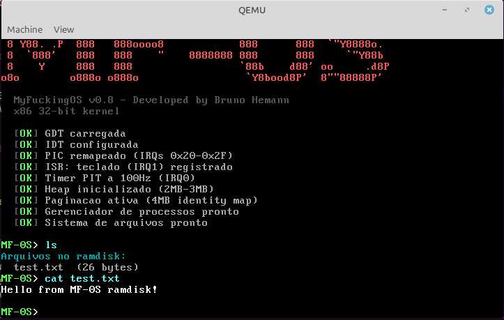

# MF-0S — MyFuckingOS

A minimal x86 kernel built from scratch in C and Assembly — a hands-on journey through boot sequences, protected mode, VGA drivers, and bare-metal hardware communication.

---

## O que é

MF-0S é um kernel x86 de 32-bit escrito do zero, sem bibliotecas, sem abstrações de sistema operacional. Cada linha de código foi escrita com o objetivo de entender o que acontece por baixo do capô de qualquer sistema operacional.

Não é um OS de produção. É um OS de aprendizado. Construído peça por peça, conceito por conceito ou seja para passar *RAIVA* e *APRENDER*.

---

## Etapa 1 — O que está implementado

- Boot via GRUB com protocolo Multiboot
- Modo protegido 32-bit
- Driver VGA text mode (80x25, 16 cores, scroll automático)
- Driver de teclado PS/2 por polling com mapa de scancodes
- Shell interativo com os comandos:
  - `help` — lista os comandos disponíveis
  - `about` — informações sobre o MF-0S
  - `clear` — limpa a tela
  - `halt` — para a CPU


---

## Etapa 2 — O que está implementado

- GDT manual — sem depender do GRUB para configuração de segmentos
- IDT — tabela de interrupções com até 256 entradas
- PIC — remapeamento de IRQs para 0x20-0x2F evitando conflito com exceções da CPU
- Teclado por interrupção via IRQ1:
  - Buffer circular para armazenamento de teclas
  - Handler dedicado substituindo o polling anterior

---

## Etapa 3 — O que está implementado

- Timer PIT a 100Hz via IRQ0 com contador de ticks
  - Comando `uptime` — exibe ticks desde o boot
- Heap com bump allocator
  - `kmalloc` com alinhamento a 4 bytes
  - Comando `memtest` — valida alocação dinâmica


---

## Etapa 4 — O que está implementado

- Paginação x86 ativa via CR0 e CR3
  - Page Directory e Page Table de 4KB alinhados
  - Identity mapping dos primeiros 4MB
  - Kernel continua acessando os mesmos endereços físicos

---

## Etapa 5 — O que está implementado

- PCB (Process Control Block) com pid, estado e stack própria
- Estados de processo: READY, RUNNING, BLOCKED
- Round-robin scheduler cooperativo
- Context switch via stack switching em Assembly
- `yield()` — cede CPU voluntariamente ao próximo processo
- `process_create()` — cria processos com entry point e stack isolada
- Validado: dois processos alternando A/B cooperativamente

---

## Etapa 6 — O que está implementado

- Scheduler preemptivo via IRQ0
  - `irq0_wrapper` salva ESP do processo interrompido
  - `timer_handler` troca de processo a cada tick
  - Processos interrompidos pelo timer sem precisar de yield()
  - Validado: dois processos alternando sem yield

---

## Etapa 7 — O que está implementado

- VGA modo gráfico 13h (320×200, 256 cores)
  - Framebuffer em 0xA0000
  - Double buffering com back_buffer em RAM
  - `vga_init_mode13h()` — ativa o modo gráfico
  - `vga_set_palette()` — define paleta de 256 cores RGB
  - `vga_put_pixel()` — escreve pixel no back_buffer
  - `vga_swap()` — copia back_buffer para o framebuffer
  - Validado: gradiente diagonal 320×200 pixels

---

## Etapa 8 — O que está implementado

- Sistema de arquivos ramdisk via módulos GRUB Multiboot
  - `fs_init()` — lê módulos carregados pelo GRUB via Multiboot info
  - `fs_open()` — busca arquivo pelo nome
  - `fs_read()` — lê bytes do arquivo com offset
  - `fs_size()` — retorna tamanho do arquivo
  - Comando `ls` — lista arquivos carregados no ramdisk
  - Comando `cat` — exibe conteúdo de um arquivo
  - Validado: test.txt carregado e lido via shell

  

---

## Etapa 9 — O que está implementado

- Paginação expandida de 4MB para 16MB
  - 4 page tables de 4MB cada (identity mapping)
  - Suporte a 0MB–16MB de memória virtual = física
  - Base de memória suficiente para carregar o Doom

---
## Doom — In Coming...
---
## Estrutura do projeto

```
MF-0S/
├── boot/
│   └── boot.asm          # Entry point: Multiboot header, stack e chamada ao kernel_main
├── kernel/
│   ├── kernel.c          # VGA driver, cursor, teclado, shell e kernel_main
│   ├── gdt.c / gdt.h     # Global Descriptor Table — segmentos de memória
│   ├── gdt_flush.asm     # lgdt + recarga dos registradores de segmento
│   ├── idt.c / idt.h     # Interrupt Descriptor Table — tabela de handlers
│   ├── idt_flush.asm     # lidt — registra a IDT na CPU
│   ├── pic.c / pic.h     # Programmable Interrupt Controller — remapeia IRQs para 0x20-0x2F
│   ├── isr.c / isr.h     # Interrupt Service Routines — handler do teclado (IRQ1)
│   ├── isr_asm.asm       # Wrappers Assembly para IRQ0 (timer) e IRQ1 (teclado)
│   ├── timer.c / timer.h # PIT a 100Hz — contador de ticks e scheduler preemptivo
│   ├── heap.c / heap.h   # Bump allocator — kmalloc sem free
│   ├── paging.c / paging.h # Paginação x86 — identity mapping dos primeiros 4MB
│   ├── process.c / process.h # PCB, scheduler round-robin, yield e context switch
│   └── switch.asm        # Context switch via stack switching em Assembly
├── iso/
│   └── boot/
│       └── grub/
│           └── grub.cfg  # Configuração do GRUB — aponta para mf0s.kernel
├── linker.ld             # Layout de memória — kernel carregado a partir de 1MB
├── Makefile              # Compila, linka, gera ISO e roda no QEMU
└── README.md
```

---

## Dependências

### Linux (Ubuntu / Debian / WSL2)
```bash
sudo apt install nasm qemu-system-x86 grub-pc-bin grub-common xorriso mtools build-essential
```

### macOS
```bash
brew install nasm qemu i686-elf-gcc i686-elf-binutils xorriso
```
> No macOS, substitui `grub-mkrescue` no Makefile por uma solução alternativa
> ou usa uma imagem Docker com as ferramentas Linux.

### Windows
Recomendado usar **WSL2** com Ubuntu e seguir as instruções do Linux.

## Como compilar e rodar

```bash
# Build completo — gera mf0s.iso
make

# Rodar no QEMU
make run

# Limpar arquivos gerados
make clean
```

---

## Referências

- [OSDev Wiki](https://wiki.osdev.org) — referência principal
- [Writing a Simple OS from Scratch](https://www.cs.bham.ac.uk/~exr/lectures/opsys/10_11/lectures/os-dev.pdf) — Nick Blundell
- [Operating Systems: Three Easy Pieces](https://ostep.org) — Arpaci-Dusseau
